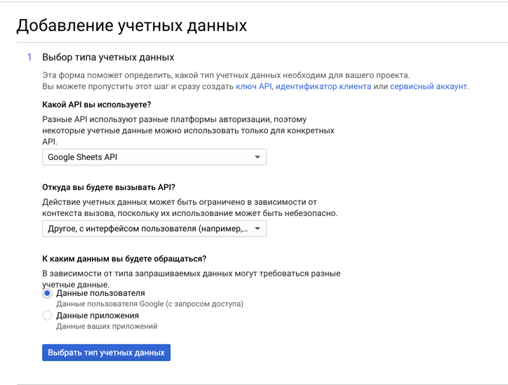

# i18n-sync

Синхронизирует файлы переводов react-intl с Google Sheets.

## Установка

`npm install @yoldi/i18n-sync`

## Настройка

### Шаг 1. Конфиг

Добавьте `i18n-sync.json` в корень проекта.

```json
{
  "langDir": "PATH_TO_LANG_DIR",
  "tokenFile": ".credentials/token.json",
  "oauthFile": ".credentials/oauth.json",
  "sheetId": "GOOGLE_SHEET_ID_FROM_URL"
}
```

### Шаг 2. Получить OAuth ключ

Создайте OAuth ключ для доступа к Google Sheet API.

Для этого на странице
[Google Developer Console Credentials](https://console.cloud.google.com/apis/credentials) нажмите «Создать учетные
данные» > «Мастер создания учетных данных».

Ответы на вопросе в форме:

1. Какой API вы используете?

   Google Sheets API

2. Откуда вы будете вызывать API?

   Другое, с интерфейсом пользователя (Например, CLI)

3. К каким данным вы будете обращаться?

   Данные пользователя



### Шаг 3. Скачать OAuth ключ

Скачайте OAuth на странице [Google Developer Console Credentials](https://console.cloud.google.com/apis/credentials) и
добавьте в проект в `.credentials/oauth.json`.

## Как пользоваться

> При первом запуске скрипт попросит авторизоваться через учетную запись Google.

```
Usage: i18n-sync [options] [command]

Options:
  -c, --config <path>  path to config file (default: "i18n-sync.json")
  -h, --help           display help for command

Commands:
  pull                 Fetch i18n from Google Sheets
  push                 Push i18n to Google Sheets
  help [command]       display help for command

```

### Примеры:

`npx i18n-sync push` — отправить переводы в таблицу

`npx i18n-sync pull` — скачать переводы из таблицы
